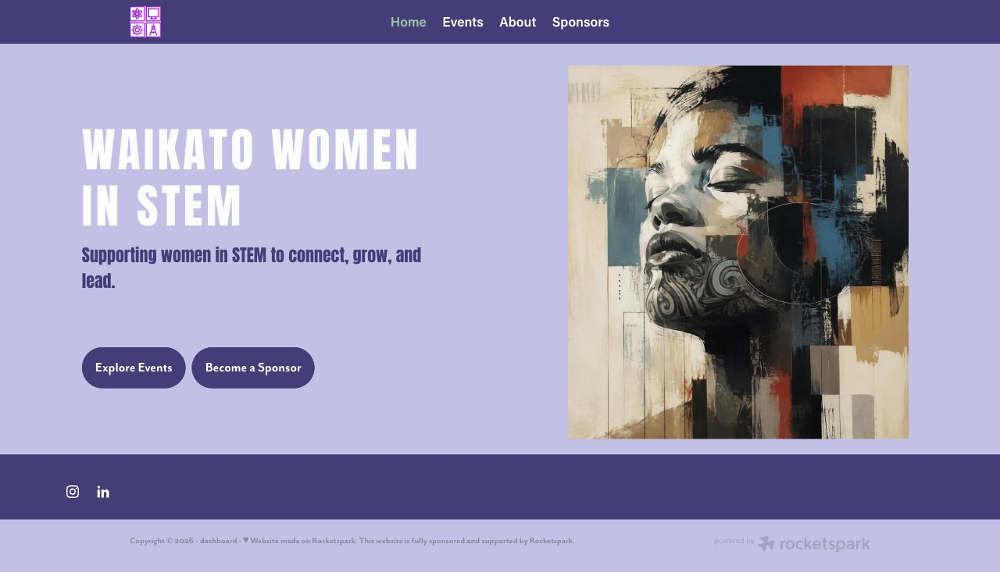
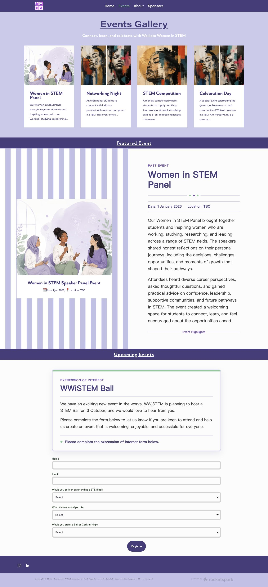
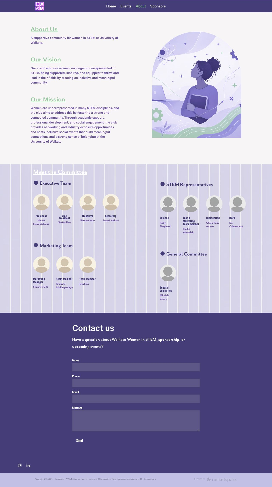
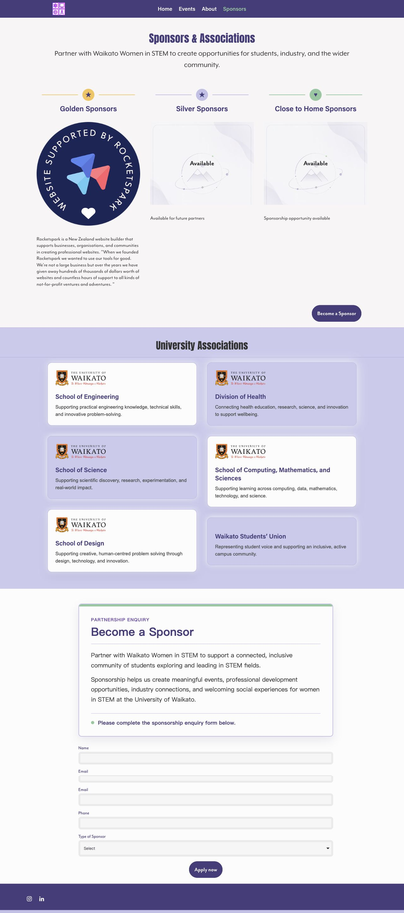
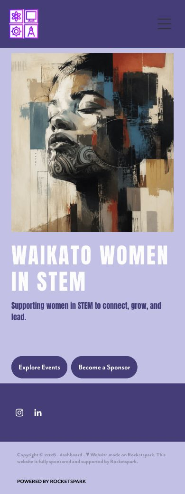
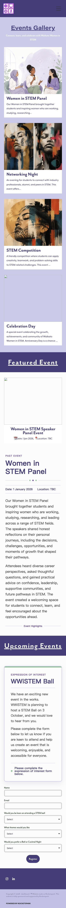
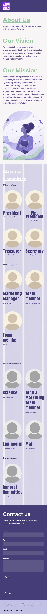
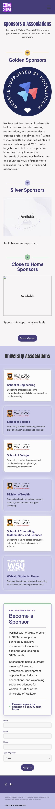

# Waikato Women in STEM Website

A four-page community website independently designed and built by Qianyu Cao using Rocketspark and custom HTML/CSS, following the project requirements brief.

[View the website](https://qianyu_cao.rocketspark.co.nz/)

## My role

I completed the website design and implementation independently, including page organisation, layout, visual styling, custom HTML/CSS and configuration in Rocketspark. Website imagery was AI-generated. This repository documents the work with screenshots and a design case study; the website is hosted and managed on Rocketspark.

## Design approach

The requirements specified a purple theme and a gentle, harmonious, simple visual style. The design uses light lavender backgrounds with darker purple navigation and buttons, clear content sections and STEM-focused messaging. Four pages guide visitors from discovering the community to exploring events and making enquiries.

| Page | Purpose |
| --- | --- |
| Home | Introduce Waikato Women in STEM and direct visitors to events and sponsorship. |
| Events | Present event information, highlights and an expression-of-interest form. |
| About | Explain the community's vision and mission, introduce its committee and provide a contact form. |
| Sponsors | Present sponsors and university associations, with a sponsorship enquiry form. |

## Custom HTML/CSS

The `custom-code/` folder contains two original snippets supplied by the author, used on the Sponsors page:

| File | Purpose |
| --- | --- |
| [university-association-card.html](custom-code/university-association-card.html) | University association card with a logo, heading, description, purple border and soft shadow. |
| [golden-sponsors-heading.html](custom-code/golden-sponsors-heading.html) | Gold dividers and a circular star badge above the purple sponsor heading, arranged with CSS Flexbox. |

These are embeddable fragments: paste each into an HTML/code block in Rocketspark. The association card's logo loads from the University of Waikato website, so its availability depends on that external URL. The fragments can also be opened locally for inspection; their appearance may inherit fonts and styles from the surrounding website.

## Desktop screenshots

### Home

### Events

### About

Includes the fully loaded committee background and all avatar groups.

### Sponsors

## Mobile screenshots

Captured at a 390px viewport width, illustrating the layout at a phone-sized breakpoint. These are browser screenshots, not physical-device test results.

| Home | Events | About | Sponsors |
| --- | --- | --- | --- |
|  |  |  |  |

## Scope and preservation

Screenshots were captured on 2 October 2026. They preserve the visible design if the original hosting link changes or becomes unavailable. The requirements document was described by the author; it is not included or independently checked in this repository. No contact, registration or sponsorship forms were submitted during capture, so end-to-end form delivery has not been verified.

Rocketspark provides the website platform and hosting. This repository contains the portfolio case study, screenshots and selected custom HTML/CSS fragments. It does not include the complete Rocketspark-generated website source. Organisation names and logos shown belong to their respective owners.
